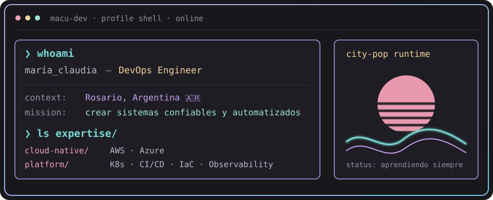

<!-- LOCAL CITY-POP BANNER -->
<a href="https://github.com/ChicoRondalla">
  <picture>
    <source media="(prefers-color-scheme: dark)" srcset="assets/banner-dark.v9.svg">
    <source media="(prefers-color-scheme: light)" srcset="assets/banner-light.v9.svg">
    
  </picture>
</a>

 

---

## `$ whoami`

  

 

## `$ cat tech-stack.yaml`

<table border="1" cellpadding="14" bgcolor="#17171c">
  <thead>
    <tr>
      <th colspan="2" align="left"><code>ChicoRondalla:~$ cat tech-stack.yaml</code></th>
    </tr>
  </thead>
  <tbody>
    <tr>
      <td width="50%" valign="top"><code>├─ ✦ core_languages:</code>  
         
        <code>C · C++ · Java · Python</code>
      </td>
      <td width="50%" valign="top"><code>├─ 🌐 web_development:</code>  
         
        <code>HTML · CSS · JavaScript</code>
      </td>
    </tr>
    <tr>
      <td valign="top"><code>├─ ⚙ methodologies:</code>  
         
        <code>Scrum · Agile · Kanban · Product Backlogs</code>
      </td>
      <td valign="top"><code>╰─ 🧠 core_concepts:</code>  
         
        <code>Manejo de Memoria · Apuntadores · Prog. Concurrente</code>
      </td>
    </tr>
  </tbody>
  <tfoot>
    <tr>
      <td colspan="2"><code>status: studying&nbsp;&nbsp;·&nbsp;&nbsp;environment: UAM-I</code></td>
    </tr>
  </tfoot>
</table>

---

## `$ kubectl get signals --all-namespaces`

  <picture>
    <source media="(prefers-color-scheme: dark)" srcset="assets/radar-dark.svg">
    <source media="(prefers-color-scheme: light)" srcset="assets/radar-light.svg">
    
  </picture>&nbsp;
  <picture>
    <source media="(prefers-color-scheme: dark)" srcset="assets/radar-langs-dark.svg">
    <source media="(prefers-color-scheme: light)" srcset="assets/radar-langs-light.svg">
    
  </picture>

<code>signals: software_skill_radar · language_stack_radar · status: healthy</code>

---

<!-- SOCIALS -->
## `$ connect --socials`

&nbsp;&nbsp;

 
 

Hecho con 💖 y mucho código desde la CDMX · @ChicoRondalla

